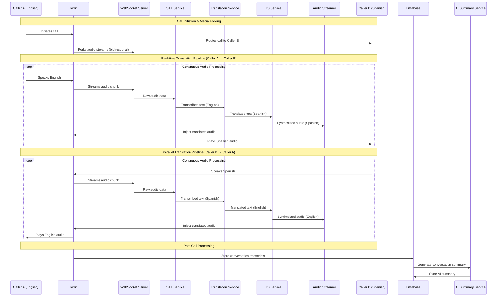

# Real-Time Voice Call Translation Application
## Master Plan & Architectural Blueprint

---

## Executive Summary

This document outlines the comprehensive architecture for a cloud-native, real-time, bidirectional voice call translation application. The system enables seamless conversation between parties speaking different languages during live telephone calls with sub-1500ms latency.

**Key Capabilities:**
- Real-time bidirectional voice translation during live calls
- Support for multiple language pairs with high accuracy
- Scalable cloud-native architecture handling thousands of concurrent calls
- Integration with Twilio for telecom services and Google Cloud AI for ML processing
- Optional AI-powered conversation summaries and transcript storage

**Technology Stack:**
- **Telecom:** Twilio (primary), SignalWire/Telnyx (alternatives)
- **AI Services:** Google Cloud Speech-to-Text, Translation AI, Text-to-Speech
- **Communication:** WebSockets for real-time audio streaming
- **Infrastructure:** Kubernetes on GCP/AWS/Azure with auto-scaling
- **Optional:** OpenAI GPT-4 for conversation summarization

---

## Detailed Architecture Diagram



---

## Component Breakdown

### 1. Telecom Integration Layer

#### **Twilio Media Streams (Primary)**
- **Responsibility:** Call routing, media forking, and audio injection
- **Technology:** Twilio Voice API with Media Streams
- **Key Features:**
  - Real-time audio streaming via WebSocket
  - Bidirectional media forking
  - Call control and routing
- **API Contract:**
  ```javascript
  // Twilio TwiML for media streaming
  <Response>
    <Start>
      <Stream url="wss://your-app.com/media-stream" />
    </Start>
    <Say>Connecting your translated call...</Say>
  </Response>
  ```

#### **Alternative Providers**
- **SignalWire:** Similar capabilities with competitive pricing
- **Telnyx:** Enterprise-grade with global coverage

### 2. Real-Time Communication Layer

#### **WebSocket Server**
- **Responsibility:** Handle real-time audio streaming from Twilio
- **Technology:** Node.js with Socket.IO or native WebSocket
- **Key Features:**
  - Audio chunk buffering and routing
  - Connection management for concurrent calls
  - Load balancing across processing services
- **API Contract:**
  ```javascript
  // WebSocket message format
  {
    "event": "media",
    "streamSid": "MZ18c7e...",
    "media": {
      "track": "inbound",
      "chunk": "2",
      "timestamp": "5",
      "payload": "base64-encoded-audio"
    }
  }
  ```

### 3. AI Processing Microservices

#### **Speech-to-Text Service**
- **Responsibility:** Convert audio chunks to text transcripts
- **Technology:** Google Cloud Speech-to-Text (Streaming Recognition)
- **Configuration:**
  - Sample rate: 8kHz (phone quality)
  - Encoding: MULAW
  - Language detection: Auto or pre-configured
- **API Contract:**
  ```javascript
  POST /stt/transcribe
  {
    "audioChunk": "base64-audio",
    "language": "en-US",
    "sessionId": "call-session-123"
  }
  // Response
  {
    "transcript": "Hello, how are you?",
    "confidence": 0.95,
    "isFinal": true
  }
  ```

#### **Neural Machine Translation Service**
- **Responsibility:** Translate text between languages
- **Technology:** Google Cloud Translation AI
- **Features:**
  - Context-aware translation
  - Custom terminology support
  - Batch processing for efficiency
- **API Contract:**
  ```javascript
  POST /nmt/translate
  {
    "text": "Hello, how are you?",
    "sourceLang": "en",
    "targetLang": "es",
    "context": "phone-conversation"
  }
  // Response
  {
    "translatedText": "Hola, ¿cómo estás?",
    "confidence": 0.92
  }
  ```

#### **Text-to-Speech Service**
- **Responsibility:** Synthesize natural-sounding speech
- **Technology:** Google Cloud Text-to-Speech (WaveNet voices)
- **Configuration:**
  - Voice selection based on target language
  - Optimized for phone audio quality
  - SSML support for natural prosody
- **API Contract:**
  ```javascript
  POST /tts/synthesize
  {
    "text": "Hola, ¿cómo estás?",
    "language": "es-ES",
    "voiceGender": "FEMALE",
    "audioFormat": "MULAW"
  }
  // Response
  {
    "audioContent": "base64-encoded-audio",
    "duration": 2.5
  }
  ```

### 4. Audio Processing & Streaming

#### **Audio Streamer Service**
- **Responsibility:** Inject synthesized audio back into calls
- **Technology:** Custom service with Twilio Media Streams
- **Features:**
  - Audio format conversion
  - Timing synchronization
  - Quality optimization for phone networks

### 5. Data & Storage Layer

#### **Conversation Database**
- **Technology:** PostgreSQL or MongoDB
- **Schema:**
  ```sql
  CREATE TABLE conversations (
    id UUID PRIMARY KEY,
    call_sid VARCHAR(255),
    caller_a_number VARCHAR(20),
    caller_b_number VARCHAR(20),
    start_time TIMESTAMP,
    end_time TIMESTAMP,
    language_a VARCHAR(10),
    language_b VARCHAR(10),
    transcript_a TEXT,
    transcript_b TEXT,
    ai_summary TEXT,
    created_at TIMESTAMP
  );
  ```

### 6. Optional AI Enhancement Services

#### **Conversation Summary Service**
- **Technology:** OpenAI GPT-4 or Azure OpenAI
- **Responsibility:** Generate intelligent conversation summaries
- **Features:**
  - Key points extraction
  - Action items identification
  - Sentiment analysis

---

## Step-by-Step Implementation Plan

### **Phase 1: Foundation & Basic Media Streaming (Weeks 1-2)**
**Objectives:**
- Set up Twilio integration
- Implement WebSocket server for audio streaming
- Create basic logging and monitoring

**Deliverables:**
- Twilio account setup with phone numbers
- WebSocket server receiving and logging audio chunks
- Basic call routing functionality
- Development environment setup

**Key Tasks:**
1. Configure Twilio Voice API and Media Streams
2. Implement WebSocket server with connection management
3. Set up audio chunk buffering and logging
4. Create basic call flow with TwiML

### **Phase 2: One-Way Translation Pipeline (Weeks 3-4)**
**Objectives:**
- Implement STT → NMT → TTS pipeline
- Test with single direction translation
- Optimize for basic latency requirements

**Deliverables:**
- Working STT service integration
- NMT service with language pair support
- TTS service with voice synthesis
- One-way translation demonstration

**Key Tasks:**
1. Integrate Google Cloud Speech-to-Text
2. Implement Translation AI service
3. Set up Text-to-Speech synthesis
4. Create audio injection back to Twilio
5. Test end-to-end latency

### **Phase 3: Bidirectional Translation (Weeks 5-6)**
**Objectives:**
- Enable full-duplex translation
- Implement concurrent processing
- Handle speaker separation and audio routing

**Deliverables:**
- Bidirectional translation system
- Concurrent processing architecture
- Speaker identification and routing
- Performance optimization

**Key Tasks:**
1. Implement parallel processing pipelines
2. Add speaker identification logic
3. Optimize concurrent audio handling
4. Test with multiple language pairs
5. Performance tuning and optimization

### **Phase 4: Production Readiness (Weeks 7-8)**
**Objectives:**
- Implement monitoring and logging
- Add error handling and resilience
- Deploy to cloud infrastructure
- Load testing and optimization

**Deliverables:**
- Production-ready deployment
- Monitoring and alerting system
- Comprehensive error handling
- Load testing results

**Key Tasks:**
1. Set up Kubernetes deployment
2. Implement comprehensive logging
3. Add health checks and monitoring
4. Conduct load testing
5. Security hardening

### **Phase 5: Value-Add Features (Weeks 9-10)**
**Objectives:**
- Implement conversation summaries
- Add transcript storage
- Create user interface
- Advanced analytics

**Deliverables:**
- AI conversation summaries
- Transcript storage and retrieval
- Web dashboard for call management
- Analytics and reporting

**Key Tasks:**
1. Integrate OpenAI for summaries
2. Implement transcript database
3. Create web interface
4. Add analytics and reporting
5. User testing and feedback

---

## Latency Mitigation Strategy

### **Target Latency Breakdown:**
- **Audio Capture to STT:** 200ms
- **STT Processing:** 300ms
- **Translation:** 100ms
- **TTS Synthesis:** 400ms
- **Audio Injection:** 200ms
- **Network & Buffer:** 300ms
- **Total Target:** <1500ms

### **Optimization Techniques:**

#### **1. Audio Processing Optimizations**
- **Streaming STT:** Use streaming recognition instead of batch processing
- **Chunk Size:** Optimize audio chunks (250-500ms) for balance between latency and accuracy
- **Voice Activity Detection:** Skip processing during silence periods
- **Parallel Processing:** Process overlapping audio chunks

#### **2. AI Service Optimizations**
- **Model Selection:** Use faster models with acceptable accuracy trade-offs
- **Regional Deployment:** Deploy services in multiple regions close to users
- **Caching:** Cache common translations and TTS outputs
- **Batch Processing:** Group multiple translation requests when possible

#### **3. Infrastructure Optimizations**
- **Edge Computing:** Deploy processing closer to users
- **CDN Integration:** Use CDN for TTS audio caching
- **Connection Pooling:** Maintain persistent connections to AI services
- **Load Balancing:** Distribute load across multiple service instances

#### **4. Network Optimizations**
- **WebSocket Optimization:** Use binary frames for audio data
- **Compression:** Implement audio compression for network transfer
- **Quality of Service:** Prioritize audio packets in network routing
- **Redundancy:** Multiple network paths for reliability

---

## Potential Challenges & Solutions

### **Challenge 1: Handling Accents and Dialects**

**Problem:** STT accuracy degrades with strong accents, regional dialects, or non-native speakers, leading to poor translation quality.

**Solutions:**
1. **Multi-Model Approach:** Deploy region-specific STT models
2. **Adaptive Learning:** Implement user-specific model fine-tuning
3. **Confidence Scoring:** Use STT confidence scores to trigger human fallback
4. **Accent Detection:** Automatically detect accent and route to appropriate model
5. **User Feedback Loop:** Allow users to correct transcriptions for model improvement

**Implementation:**
```javascript
// Accent detection and model routing
const detectAccent = (audioFeatures) => {
  // ML model to classify accent/dialect
  return accentClassifier.predict(audioFeatures);
};

const selectSTTModel = (accent, language) => {
  return `${language}-${accent}-optimized-model`;
};
```

### **Challenge 2: Managing Cross-Talk and Overlapping Speech**

**Problem:** When both parties speak simultaneously, the system may produce garbled translations or miss important information.

**Solutions:**
1. **Speaker Diarization:** Implement advanced speaker separation
2. **Audio Mixing Detection:** Detect when multiple speakers are active
3. **Priority Queuing:** Process audio chunks in chronological order
4. **Conflict Resolution:** Implement "excuse me" or "please repeat" automated responses
5. **Buffer Management:** Maintain separate audio buffers for each speaker

**Implementation:**
```javascript
// Cross-talk detection and management
class CrossTalkManager {
  detectOverlap(audioStreamA, audioStreamB) {
    const energyA = calculateAudioEnergy(audioStreamA);
    const energyB = calculateAudioEnergy(audioStreamB);
    
    return energyA > threshold && energyB > threshold;
  }
  
  handleOverlap(streamA, streamB) {
    // Implement priority logic or request clarification
    return {
      action: 'request_clarification',
      message: 'I detected overlapping speech. Could you please repeat?'
    };
  }
}
```

### **Challenge 3: Ensuring Security and Privacy**

**Problem:** Voice calls contain sensitive information that must be protected during processing and storage.

**Solutions:**
1. **End-to-End Encryption:** Encrypt audio data in transit and at rest
2. **Zero-Knowledge Processing:** Process audio without storing raw content
3. **Compliance Framework:** Implement GDPR, HIPAA, and other regulatory compliance
4. **Access Controls:** Strict authentication and authorization for all services
5. **Audit Logging:** Comprehensive logging for security monitoring
6. **Data Retention Policies:** Automatic deletion of sensitive data after specified periods

**Implementation:**
```javascript
// Security middleware for audio processing
class SecurityManager {
  encryptAudioChunk(audioData, sessionKey) {
    return crypto.encrypt(audioData, sessionKey);
  }
  
  anonymizeTranscript(transcript) {
    // Remove PII using NLP techniques
    return piiRemover.process(transcript);
  }
  
  auditLog(action, userId, sessionId) {
    logger.security({
      timestamp: new Date(),
      action,
      userId,
      sessionId,
      ipAddress: request.ip
    });
  }
}
```

### **Additional Challenges & Mitigations:**

#### **Challenge 4: Cost Optimization**
- **Solution:** Implement intelligent caching, use spot instances, optimize API calls
- **Monitoring:** Real-time cost tracking and alerts

#### **Challenge 5: Service Reliability**
- **Solution:** Multi-region deployment, circuit breakers, graceful degradation
- **Fallback:** Human interpreter service integration for critical calls

#### **Challenge 6: Quality Assurance**
- **Solution:** A/B testing for model improvements, user feedback systems
- **Monitoring:** Real-time quality metrics and automated alerts

---

## Infrastructure & Deployment Architecture

### **Cloud-Native Kubernetes Deployment**

```yaml
# Example Kubernetes deployment structure
apiVersion: apps/v1
kind: Deployment
metadata:
  name: voice-translation-api
spec:
  replicas: 3
  selector:
    matchLabels:
      app: voice-translation-api
  template:
    metadata:
      labels:
        app: voice-translation-api
    spec:
      containers:
      - name: api-server
        image: voice-translation:latest
        ports:
        - containerPort: 3000
        env:
        - name: TWILIO_ACCOUNT_SID
          valueFrom:
            secretKeyRef:
              name: twilio-secrets
              key: account-sid
        resources:
          requests:
            memory: "512Mi"
            cpu: "250m"
          limits:
            memory: "1Gi"
            cpu: "500m"
```

### **Auto-Scaling Configuration**
- **Horizontal Pod Autoscaler:** Scale based on CPU/memory usage
- **Vertical Pod Autoscaler:** Optimize resource allocation
- **Custom Metrics:** Scale based on active call volume

### **Monitoring & Observability**
- **Prometheus + Grafana:** Metrics collection and visualization
- **ELK Stack:** Centralized logging and analysis
- **Jaeger:** Distributed tracing for latency analysis
- **Custom Dashboards:** Real-time call quality and system health

---

## Cost Optimization Strategies

### **1. AI Service Optimization**
- **Batch Processing:** Group translation requests to reduce API calls
- **Caching:** Store common translations and TTS outputs
- **Model Selection:** Balance cost vs. accuracy for different use cases
- **Regional Optimization:** Use closest AI service regions

### **2. Infrastructure Optimization**
- **Spot Instances:** Use for non-critical processing workloads
- **Reserved Instances:** Long-term commitments for predictable workloads
- **Auto-Scaling:** Scale down during low-usage periods
- **Resource Right-Sizing:** Optimize container resource allocation

### **3. Telecom Cost Management**
- **Number Pooling:** Efficiently manage phone number inventory
- **Call Routing:** Optimize routing to reduce per-minute costs
- **Usage Analytics:** Monitor and optimize call patterns

---

## Success Metrics & KPIs

### **Technical Metrics**
- **End-to-End Latency:** <1500ms target
- **Translation Accuracy:** >90% BLEU score
- **System Availability:** 99.9% uptime
- **Concurrent Call Capacity:** 1000+ simultaneous calls

### **Business Metrics**
- **User Satisfaction:** Net Promoter Score (NPS)
- **Call Completion Rate:** % of calls successfully translated
- **Cost Per Call:** Total cost divided by successful calls
- **Revenue Per User:** Monetization effectiveness

### **Quality Metrics**
- **STT Accuracy:** Word Error Rate (WER) <10%
- **Translation Quality:** Human evaluation scores
- **TTS Naturalness:** Mean Opinion Score (MOS) >4.0
- **User Retention:** Monthly active users growth

---

This comprehensive architecture provides a solid foundation for building a production-ready, scalable real-time voice translation system. The modular design allows for iterative development and continuous improvement while maintaining high performance and reliability standards.